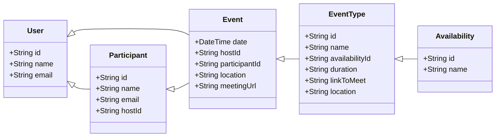

# my-calendar domínio

A documentação do domínio ajuda na comunicação e na compreensão do modelo de dados e implementação de regras e relacionamentos.

# Linguagem Ubíqua

Vocabulário comum que usamos entre todos os times quando conversamos sobre as funcionalidades do sistema.

Em ordem alfabética:

### Calendário

Representa o calendário do usuário. No sistema o calendário do usuário é implícito e representado pelo próprio usuário. Todos os eventos estão associados ao próprio usuário.

No escopo estendido, contas conectadas podem ser utilizadas para fazer a união de outros calendários para cálculo de disponibilidade e replicação de eventos.

### Conta

A conta do usuário no sistema. A conta está diretamente associada ao calendário do usuário e ao usuário.

### Conta Conectada (Connected Account)

Contas de provedores terceiros como Google e Microsoft. Na versão do MVP estendido o usuário poderá conectar estas contas para usar informações sobre eventos de calendários e criação de links para reuniões virtuais.

### Disponibilidade (Availability)

Horários em que o usuário está disponível para eventos. O usuário pode ter mais do que uma disponibilidade que pode ser usada para diferenciar quais eventos poderão ser agendados em quais horários.

### Evento (Event)

É um evento marcado entre o usuário e um ou mais participantes para um determinado dia/horário. O evento está associado ao usuário.

### Participante (Participant)

Um participante é alguém que está marcando ou marcou um evento com um usuário.

### Tipo de evento (EventType)

Quando um evento é marcado entre o usuário e participantes, o tipo de evento indica do que vai ser tratado naquele evento. Exemplos podem ser: uma consultoria, uma entrevista ou uma demonstração de produto.

### Usário (User)

Um usuário que está logado no sistema e tem um calendário disponível.

# Entidades

